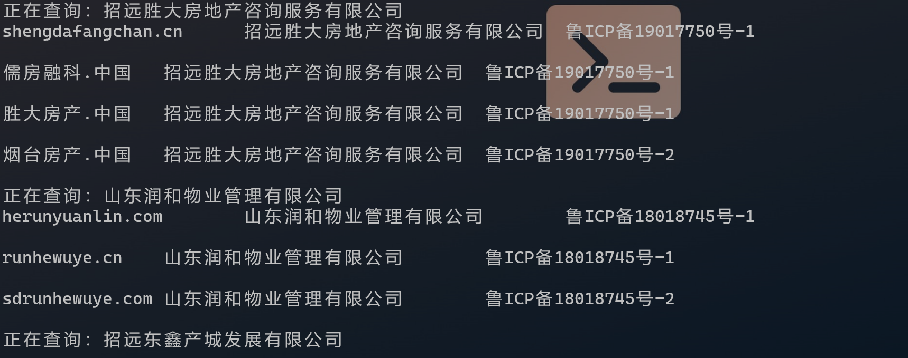
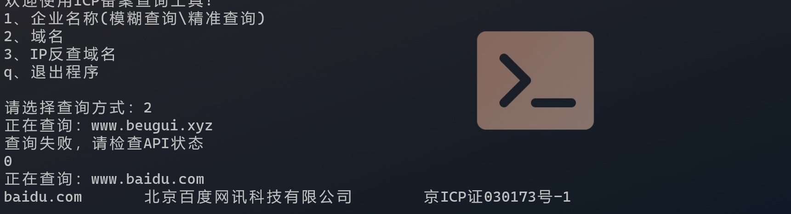
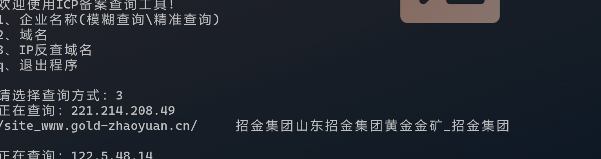

### 网信资产收集工具

1、模糊/准确反查通过企业名称查询备案（第三方接口）

​	模糊查询可输入部分企业名进行查询 输出结果到org_icp.txt

准确查询读取org.txt输出结果到org_icp.txt

2、域名查询备案（第三方接口）

读取domain.txt输出结果到domain_icp.txt

3、ip反查域名

读取ip.txt输出到ip_domain.txt

